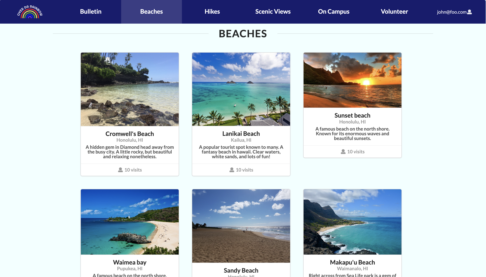

 
 Landing Page that I designed with the help of my team.

## Touch Grass (Project Overview)

Our Web application Over Da Rainbow tackles an emerging epidemic in a fun way. Our application can be used by students and staff in the University of Hawaii system who wish to explore the great outdoors. Going outside and getting your daily dose of Vitamin D is pivotal in mood and performance for all human beings. Most students would love to take a break from their assigments and enjoy the outside world for a while. The problem is that a large percentage of University of Hawaii students are not familiar with the beautiful locations and activities that Oahu has to offer. Over da Rainbow provies an easy to use application that allows anyone to find fun outdoor activities! Just make an account with your school email and gain access to all the insight we offer. Users can leave reviews at each location to advise future explorers! You can also use our bulletin page where users can coordinate upcoming events and leave comments to coordinate meets.

.  

## What I learned and Contributed

Throughout the development of this application, I was primarily in charge of deployment. I ensured that our local application was deployed to the Web for all to see and take advantage of. From buying the domain to deploying it through the Digital Ocean platform. The rest of the team and I compiled a list of Oahu's safest and most enjoyable locations for our users to venture to. I designed a card component where these locations could be displayed clearly with their respective information. We ensured each location was displayed in its designated category and I took care of deploying the data and images to the Web. Working on this project alongside my three team members has taught me numerous things. I have learned many things about both software engineering and about being part of a team. This project was completed because of the hard work that each of my team members put in. 

Our organization Github Page can be found [here](https://github.com/over-da-rainbow/over-da-rainbow)
