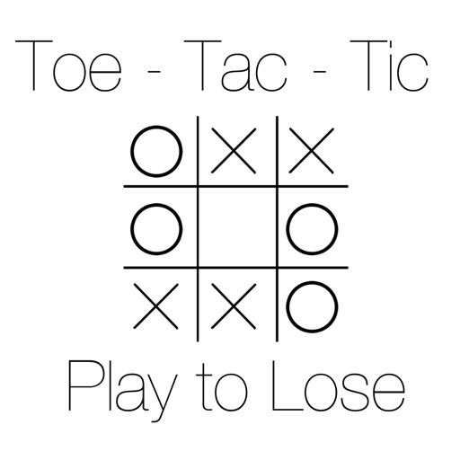

  
 

Inverse Tic Tac Toe was my first real project as a computer science student. I set out after my first semester of coding in Java, to create a simple game with my newfound knowledge. I decided on a game like tic tac toe because it was simple and widely known. However, normal tic tac toe was too simple and had already been done many times before me. Inverse tic tac toe was a way to add a little twist to an already popular game. Inverse tic tac toe is a game where instead of trying to connect three consecutive X’s or O’s, you are trying to force your opponent to do so before you. If a player happens to connect three consecutive squares across the board, they will LOSE in a game of inverse tic tac toe. Hence the “inverse” part of the name.

One of the challenges that I faced on this solo project was with the use of graphics on Java. The board, the X and O(the O’s were diamonds in this instance) were all created with the graphics class in Java. This was a struggle as a new coder because I had no experience with graphics or colors or anything of that sort. However, because of this project, I became more familiar with the graphics classes in Java. I also found a bit of confidence within myself after completing a program of this size.

